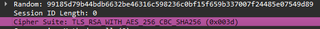
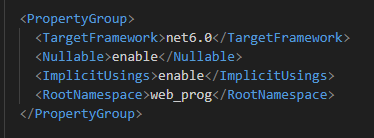
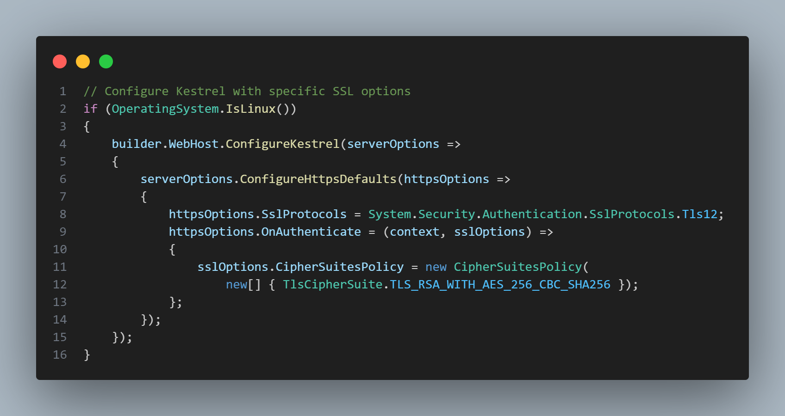
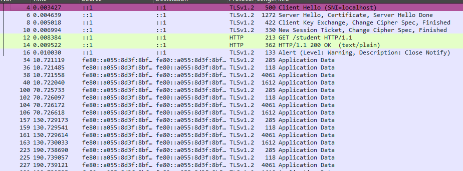
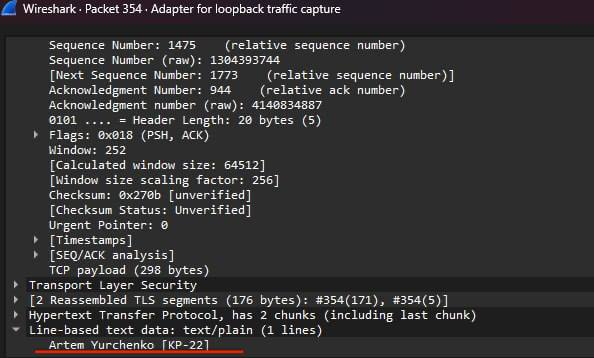

# web-prog

1. Отже, для виправлення минулої версії роботи я застосував докер на Linux, так як я знайшов інформацію, що саме через Windows я не мав змоги застосувати саме протокол TLS_RSA_WITH_AES_CBC_SHA256, який менш захищений, але в докері цей протокол зміг запрацювати, як ми бачимо на скріні

2. Також я застосував dotnet 6 на всякий випадок, але на мою думку це пов'язано не з цим

3. Ось код який примусово допомагає саме в linux застосовувати протокол який нам потрібно

4. Ось можемо бачити результат розшифрованого respond 

